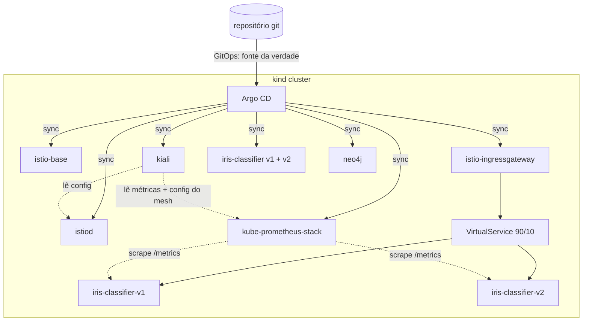

# kiale — GitOps demo: Kubernetes + Argo CD + Istio + Prometheus + Grafana + Kiali + IA

Ambiente local, 100% automatizado, que sobe um cluster Kubernetes (kind) e usa **Argo CD**
(padrão *app of apps*) pra instalar e manter declarativamente:

- **Istio** (service mesh: base + istiod + ingress gateway)
- **kube-prometheus-stack** (Prometheus + Grafana)
- **Kiali** (visualização do mesh)
- **iris-classifier**: um serviço de IA simples (scikit-learn) com **duas versões** (v1
  `LogisticRegression` / v2 `RandomForestClassifier`) roteadas via Istio (90%/10%), pra
  demonstrar traffic-splitting/canary e aparecer bonito no grafo do Kiali.

Tudo neste repositório roda **via WSL** — é onde estão o Docker, o git e as ferramentas.

## Arquitetura



## Estrutura

```
cluster/              config do kind (nós do cluster local)
scripts/              automação: instalar ferramentas, subir cluster, argocd, bootstrap
gitops/argocd/        Applications do Argo CD (app-of-apps: istio, prometheus, kiali, iris)
apps/iris-classifier/ código-fonte (FastAPI + scikit-learn) + Helm chart do app
```

## Pré-requisitos

- WSL com Docker funcionando (`docker --version`)
- Nada mais — `kubectl`, `kind` e `helm` são instalados automaticamente pelos scripts

## Subir tudo

```bash
cd scripts
./up.sh
```

Isso: instala kubectl/kind/helm em `~/.local/bin`, cria o cluster kind, builda e carrega a
imagem do `iris-classifier`, instala o Argo CD e aplica o *root Application*. A partir daí o
Argo CD sincroniza sozinho: istio → prometheus/grafana → kiali → iris-classifier.

Acompanhar:
```bash
kubectl -n argocd get applications -w
```

Quando tudo estiver `Synced`/`Healthy`, abra os acessos locais:
```bash
./scripts/port-forward.sh
```

| Serviço    | URL                          | Credenciais |
|------------|-------------------------------|-------------|
| Argo CD    | https://localhost:8081         | `admin` / senha impressa por `02-install-argocd.sh` |
| Kiali      | http://localhost:20001         | anônimo (demo) |
| Grafana    | http://localhost:3000          | `admin` / `prom-operator` |
| Prometheus | http://localhost:9090          | — |
| Iris demo  | http://localhost:8080 (header `Host: iris.kiale.local`) | — |
| Neo4j      | http://localhost:7474 (browser) / bolt://localhost:7687 | `neo4j` / `kiale12345` |

Exemplo de chamada ao demo via Istio ingress gateway (precisa do header `Host`, já que o
Gateway/VirtualService usam um host concreto em vez de wildcard - exigência do webhook de
validação do Istio):
```bash
curl -H "Host: iris.kiale.local" http://localhost:8080/healthz
curl -H "Host: iris.kiale.local" -X POST http://localhost:8080/predict \
  -H 'Content-Type: application/json' \
  -d '{"sepal_length":5.1,"sepal_width":3.5,"petal_length":1.4,"petal_width":0.2}'
```

Parar os port-forwards: `./scripts/stop-port-forward.sh`
Derrubar tudo: `./scripts/down.sh`

### Consumindo o Neo4j a partir do Windows (ex.: Backstage em localhost:3000)

Como o cluster kind roda dentro do WSL, o `kubectl port-forward` do `neo4j` (feito por
`scripts/port-forward.sh`) escuta em `127.0.0.1` **dentro do WSL**. O WSL2 encaminha
automaticamente portas de `127.0.0.1` para o Windows ("localhost forwarding"), então uma
aplicação rodando nativamente no Windows — como o Backstage em `http://localhost:3000` —
consegue acessar o Neo4j normalmente em:

- HTTP/Browser: `http://localhost:7474`
- Bolt: `bolt://localhost:7687` (usuário `neo4j`, senha `kiale12345`)

Basta manter `./scripts/port-forward.sh` rodando (ele já inclui o forward do Neo4j) enquanto
o Backstage estiver em uso. Se o plugin de catálogo/graph do Backstage pedir a URL de conexão,
use `bolt://localhost:7687`.

> A senha é fixada em `gitops/argocd/apps/neo4j.yaml` (`neo4j.password`) só para fins de demo —
> troque-a se for expor o serviço além do localhost.

## Sobre o repositório remoto

Os `Application` do Argo CD (em `gitops/argocd/`) apontam para
`https://github.com/jgpjuniorj/training.git` via HTTPS. Se o repo for privado, cadastre
credenciais no Argo CD (`kubectl -n argocd create secret ...` ou `argocd repo add`) ou torne
o repo público — sem isso o Argo CD não consegue clonar e as Applications ficam com erro de
sync.

## Sobre a demo de IA

`apps/iris-classifier` é um serviço FastAPI mínimo: treina (em build-time, dentro da imagem)
dois modelos scikit-learn no dataset clássico Iris e serve `/predict`. A mesma imagem é usada
nas duas versões — só muda a env var `MODEL_VERSION`. Isso deixa a demo simples de entender
e ainda assim funcional o bastante pra mostrar métricas reais (`/metrics`, Prometheus,
Grafana) e roteamento real de tráfego (Istio VirtualService + Kiali).

Reconstruir a imagem após alterar o código:
```bash
./scripts/build-load-image.sh
```

## Notas

- Versões de chart do Istio/kube-prometheus-stack/Kiali/Neo4j em `gitops/argocd/apps/*.yaml`
  estão fixadas; ajuste `targetRevision` se quiser versões mais novas.
- `iris-demo` namespace recebe o label `istio-injection: enabled` — os pods do app sobem com
  sidecar Envoy automaticamente.
- O Neo4j sobe como instância standalone (Community Edition, chart oficial `neo4j/neo4j`),
  sem service `LoadBalancer` (kind não tem provisionador de LB) — o acesso é só via
  `kubectl port-forward` (feito por `scripts/port-forward.sh`).
- Observabilidade automática do Neo4j: o namespace `neo4j` recebe `istio-injection: enabled`
  (via `managedNamespaceMetadata` no Application do Argo CD), então o sidecar Envoy captura
  métricas HTTP (porta 7474) e TCP (porta 7687/bolt) sem precisar de exporter — aparece
  sozinho no Kiali e no Prometheus/Grafana, igual aos demais serviços do mesh.
  ([Pixie](https://docs.px.dev/) foi avaliado para essa automação, mas [não é suportado em
  `kind`](https://docs.px.dev/installing-pixie/requirements/) — o cluster roda como container
  Docker, não uma VM/kernel dedicado, que é o que o eBPF do Pixie exige.)
